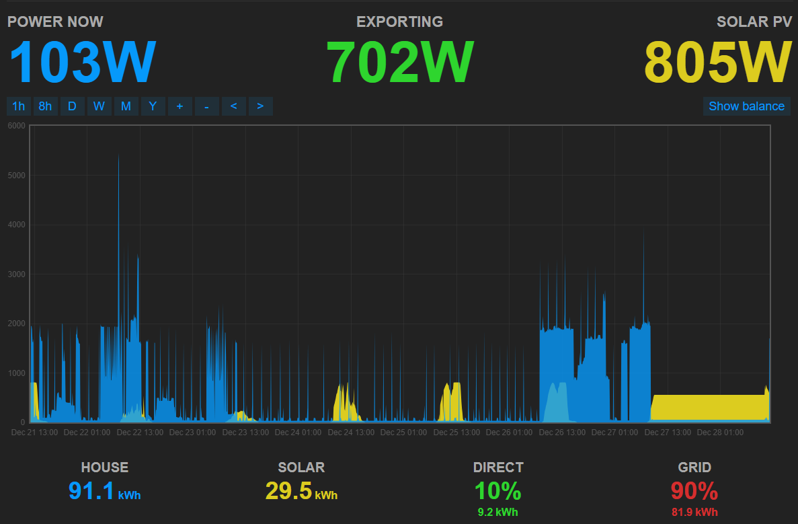

# Multi Energy Monitor Project (BETA!)

This project is designed quick and dirty to monitor multiple energy sources using the ESP32 microcontroller and 3 PZEM_004T Sensors and displays it on a simple web interface. Key features include:

- **Solar Data Monitoring**: Measures power, current, energy, frequency, voltage, and power factor from solar panels.
- **Consumption Data Monitoring**: Tracks power consumption, current, energy usage, frequency, voltage, and power factor of a house.
- **Grid Data Monitoring**: Monitors power, current, energy, frequency, voltage, and power factor from the power grid.
- **WiFi Connectivity**: Connects to a WiFi network to provide real-time data access via a web server.
- **EmonCMS**: Sends Data to a local EmonCMS server hosted on a Respberry PI 
- **Web Interface**: Displays collected data on a simple web page.
- **Reboot Functionality**: Includes a reboot button on the web interface to restart the ESP32 remotely.
- **Runtime Display**: Shows the system's runtime in days, hours, minutes, seconds, and milliseconds.
- **Signal Strength**: Displays the WiFi signal strength (RSSI) on the web interface.

*ESP32-S3 from SeedStudio*
 
 

*The 3 PZEM_004T Sensors and the clamp meters*
 
 

*ESP32 simple webserver*
 
 

*EmonCMS Dashboard*
 
 
 
This project is ideal for monitoring energy usage from the power grid, the solar panels and the consumption of a house.